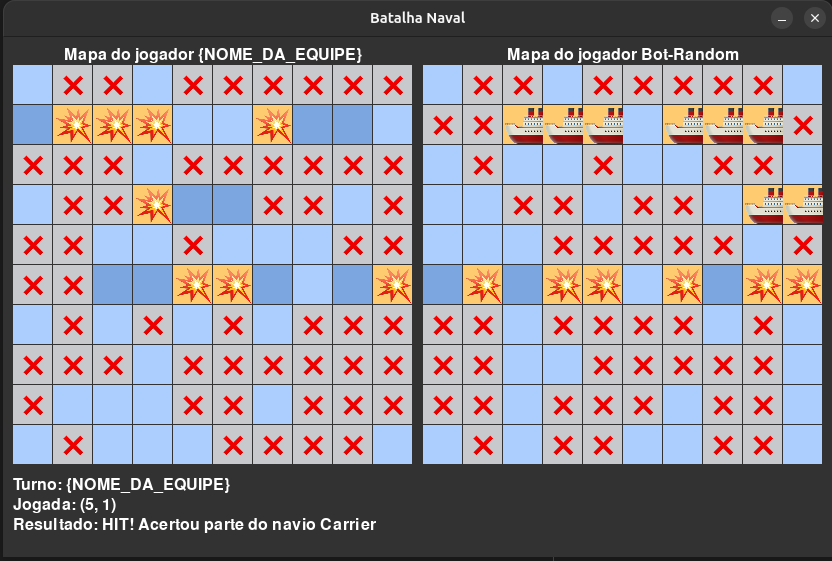

# Batalha Naval

**Batalha Naval** (também conhecida como *Battleships*) é um jogo de adivinhação estratégica para dois jogadores. É jogado em grades marcadas (em papel ou tabuleiro), nas quais cada jogador posiciona sua frota de navios de guerra. **As posições dos navios do adversário são mantidas ocultas**. Os jogadores se revezam efetuando "disparos" no tabuleiro do oponente e o objetivo é destruir completamente a frota adversária, ou seja, afundar todos os seus navios. O jogo termina quando um dos jogadores afunda toda a frota inimiga.

Seguiremos como base as regras do jogo da Hasbro, disponíveis em [https://www.hasbro.com/common/instruct/battleship.pdf](https://www.hasbro.com/common/instruct/battleship.pdf), com algumas modificações para facilitar a implementação, conforme descrito abaixo.

## Objetivo do Projeto

Neste projeto da disciplina **MC102**, você deverá desenvolver uma **estratégia de ataque** para o jogo Batalha Naval, que envolverá:

- Um algoritmo para **definir as posições dos seus navios**. Este algoritmo será executado **apenas uma vez**, no início do jogo. 
  - *Atenção*: Seus navios não podem ser sobrepostos e nem posicionados fora dos limites do mapa. E devem ser posicionados horizontal ou verticalmente.
- Um algoritmo para **atacar os navios do oponente**, que deve buscar maximizar as chances de acerto. Este algoritmo será executado a **cada rodada**, ou seja, a cada disparo realizado.
  - *Atenção*: Caso você ataque uma posição mais de uma vez, o jogo continua, mas você perde a jogada, isto é, perde a chance de acertar um navio. Portanto, é importante que você tenha um controle das posições já atacadas.

O jogo acontece em um tabuleiro **10x10**, e cada jogador dispõe de **5 navios**, distribuídos conforme os tamanhos a seguir:
- 1 navio de tamanho 5, o "Carrier"
- 1 navio de tamanho 4, o "Battleship"
- 1 navio de tamanho 3, o "Cruiser"
- 1 navio de tamanho 3, o "Submarine"
- 1 navio de tamanho 2, o "Destroyer"

Isso significa que você *precisa* definir a posição de todos esses navios no tabuleiro. O restante do tabuleiro será composto por água (automaticamente).

------

## Jogabilidade

No início do jogo, os navios são posicionados conforme a estratégia definida (antes da interface gráfica ser exibida). Em seguida, a tela do jogo apresenta dois tabuleiros: um para o jogador e outro para o oponente, com todas as posições inicialmente exibidas em duas formas: azul claro, para água; e azul escuro para mostrar onde os navios estão posicionados.
Como o jogo é automatizado, não há problemas em mostrar as posições dos navios durante a execução, mas isso não significa que, na implementação do código, você saberá onde os navios do oponente foram inicializados.

A cada rodada, o jogador realiza um disparo em um quadrado do tabuleiro do oponente, e o resultado do tiro é exibido de acordo com os seguintes casos:

- **água:** o quadrado fica **cinza** com o emoji ?, pois o tiro foi em uma posição sem navio, isto é, posição de água;
- **acertou:** o quadrado fica **amarelo** com o emoji ?? se acertar uma posição de um navio.
- **afundou:** o quadrado fica **amarelo** com o emoji ?? se afundar um navio, isto é, se o tiro atingir a última posição de um dos navios da frota.

### Exemplo de tabuleiro:
{ width=600px }

No imagem acima temos uma demonstração de um jogo em andamento. Perceba os ataques que deram certo (??), os que não acertaram (?), e os navios afundados (??), assim como as posições em azul mais escuro onde os navios foram posicionados.

### Bots
No modo *Aluno vs Bot*, o jogador implementado pelo aluno enfrentará um bot com estratégia predefinida. Você pode consultar o código do bot para entender sua lógica de posicionamento e ataque, porém, **está proibido copiar estratégias do bot**. Você precisa criar a sua própria estratégia.

Temos dois bots disponíveis:

**1.** `bot_linear.py`: um bot que utiliza uma estratégia linear tanto para posicionar os navios quanto para atacar. Na fase de posicionamento, ele organiza os navios em linha reta (horizontal ou vertical) e de forma agrupada. Durante o ataque, ele dispara sequencialmente ao longo de uma linha;
**2.** `bot_random.py`: um bot que posiciona os navios aleatoriamente em linhas horizontais e ataca os navios aleatoriamente;

> **IMPORTANTE:**
> Sua implementação não deve buscar vencer um bot em especifico. Caso os avaliadores detectem que a sua implementação tenta reconhecer contra qual bot está jogando, a nota do projeto será afetada.

------

## Estrutura do Projeto

A estrutura do projeto é composta por diversos arquivos, cada um com uma função específica. Abaixo, você encontrará uma breve descrição de cada um deles:

### Constantes
No arquivo `constants.py`, você encontrará algumas constantes que podem ser úteis para a implementação do seu jogador. As constantes são:
- `TABULEIRO_TAMANHO`: tamanho do tabuleiro (10);
- `NAVIOS`: dicionário em que cada chave é o nome do navio e o valor é o tamanho do dele;

Neste mesmo arquivo, temos a [Enumeração](https://docs.python.org/3/library/enum.html) chamada `StatusTab` com os possíveis estados do tabuleiro, representados por inteiros. Esses estados são:
- `AGUA`: representa uma posição do tabuleiro que teve um ataque sem acerto;
- `NAVIO_ENCONTRADO`: representa uma posição de navio encontrado (acerto);
- `NAVIO_INTEIRO_ATINGIDO`: representa uma posição de navio afundado (afundado);
- `DESCONHECIDO`: representa uma posição que ainda não foi atingida para saber se tem navio ou não;
Para acessar estas constantes, garanta que o Enum esteja importado (`from constants import StatusTab`), e utilize `StatusTab.NOME_DA_CONSTANTE.value` para acessar o valor inteiro correspondente (ex: `StatusTab.AGUA.value`).

Já no arquivo `config.py`, você encontrará somente duas constantes:
- `DELAY`: tempo de espera entre os ataques (em segundos). Quando estiver testando seu código, você pode aumentar ou diminuir esse valor para facilitar a visualização do jogo;
- `FINAL_DELAY`: tempo de espera para fechar a tela do jogo (em segundos).

------

### Classes

Seu projeto é composto por **cinco tipos de classes principais**, cada uma com um papel fundamental no jogo. Confira abaixo um resumo do que cada uma faz:

### `Navio` (arquivo `_ship.py`)

Representa um navio no tabuleiro.  
Essa classe **não tem métodos**, apenas atributos:

- `nome`: string que representa o nome do navio (ex: "Carrier");
- `tamanho`: inteiro que indica o tamanho do navio;
- `coords`: lista de tuplas com as posições ocupadas pelo navio no tabuleiro (`list[tuple[int,int]]`);
- `posicoes_afundadas`: lista de tuplas com as posições que já foram atingidas.

---

### `Ataque` (arquivo `_attack.py`)

Representa um ataque feito por um jogador.

- `x` e `y`: inteiros que indicam as coordenadas do ataque.  
O **construtor já garante** que os valores estejam dentro dos limites do tabuleiro. Caso não estejam, o construtor irá gerar um erro.

---

### `PosMatriz` (arquivo `_matrix.py`)
Representa uma posição no tabuleiro, com os seguintes atributos:
- `status`: inteiro que representa o status da posição de acordo com as contantes definidas no arquivo `constants.py`. Esse inteiro vem do Enum `StatusTab` (ex: `StatusTab.AGUA.value`);
- `navio`: string do nome do tipo de navio que ocupa a posição, caso exista um navio ali. Se não houver navio, o valor será uma string vazia (`""`);
  - *Atenção*: O valor do atributo `navio` é **definido automaticamente** quando um navio é posicionado no tabuleiro. Você não deve modificar esse valor diretamente, mas pode acessá-lo para verificar se uma posição contém um navio ou não;

---

### `AlunoPlayer` (arquivo `player_aluno.py`)

**Ela representa o seu jogador**! Ou seja, é neste arquivo que você deve implementar a sua estratégia de ataque e posicionamento dos navios.
Essa classe possui os seguintes atributos:

- `movimentos_realizados`: lista de objetos `Ataque` (histórico dos ataques);
- `tabuleiro`: objeto da classe `Tabuleiro`, que representa o tabuleiro do jogador.
- `nome`: o nome da equipe jogador.

E possui os seguintes métodos (que devem ser implementados):
- `jogar(self, estado_atual_oponente, navios_afundados) -> Ataque`: define a estratégia de ataque.  
  - `estado_atual_oponente`: estado do tabuleiro do oponente, representada por uma matriz 10x10 composta por objetos do tipo `PosMatriz`. Isso significa que você pode acessar (mas não modificar) o estado público do tabuleiro do oponente para saber quais posições atingidas são parte de um navio ou não. 
    - Por exemplo, se você quiser saber se a posição (2, 3) do tabuleiro do oponente é um navio ou não, você pode verificar o status da posição acessando `estado_atual_oponente[2][3].status` e verificar se o valor é igual `StatusTab.NAVIO_ENCONTRADO.value` ou `StatusTab.NAVIO_INTEIRO_ATINGIDO.value`. Para saber se a posição (2, 3) contém um navio, você pode acessar o atributo `navio` da posição acessando `estado_atual_oponente[2][3].nome_navio_atingido` e verificar se o valor é diferente de `""`.;
  - `navios_afundados`: lista dos nomes dos navios já afundados. Lembre-se de que na constante `NAVIOS` do arquivo `constants.py` o nome do navio é a chave e o tamanho é o valor. Isso pode te ajudar a identificar os tamanhos dos navios dessa lista.
  
- `posicoes_navios(self) -> list[Navio]`: define onde os navios serão posicionados no início do jogo.

---

### Bots já implementados

- `BotPlayerLinear` (arquivo `bot_linear.py`)
- `BotPlayerRandom` (arquivo `bot_random.py`)

Esses bots funcionam como exemplos, com estratégias simples de jogo.  
Você pode **analisar** como eles funcionam, mas **não deve copiá-los ou adaptá-los** diretamente.

---

### `Tabuleiro` (arquivo `_board.py`)

Representa o tabuleiro do jogador, com os seguintes métodos (os quais não devem ser alterados):

- `receber_ataque(ataque)`: atualiza o tabuleiro com base no ataque recebido;
- `posicionar_navio(navio)`: posiciona um navio no tabuleiro;
- `estado_publico()`: retorna a visão pública do tabuleiro, sem mostrar navios ocultos ainda não atingidos;
- `navios_afundados()`: lista os navios já afundados;
- `todos_afundados()`: diz se todos os navios foram destruídos.

#### Atributos do Tabuleiro

- `matriz`: matriz 10x10 com os seguintes valores constituída de objetos do tipo `PosMatriz`. Essa matriz representa o estado do tabuleiro do jogador, isto é, contém as posições dos navios e os ataques realizados;
- `matriz_visivel`: matriz 10x10 com os seguintes valores constituída de objetos do tipo `PosMatriz`. Essa matriz representa o estado do tabuleiro a ser disponibilizado ao oponente, isto é, não mostra os navios ocultos ainda não atingidos;
- `navios`: lista de navios posicionados;
- `afundados`: lista de navios já destruídos.

------

### O que devo implementar?
Você deve modificar **apenas** o arquivo `player_aluno.py`. Nele, é obrigatório implementar os métodos `posicoes_navios(self)` e `jogar(self, estado_atual_oponente, navios_afundados)`, descritos acima.

Além disso, **substitua** o trecho `self.nome = "{NOME_DA_EQUIPE}"` no construtor (`__init__`) pelo seu nome da sua equipe, para que ele seja exibido corretamente na interface do jogo.

Você pode consultar os outros arquivos para entender como o jogo funciona, mas não deve modificá-los, exceto a constante `DELAY` no arquivo `config.py`, que pode ser alterada para facilitar a visualização da simulação do jogo ao alterar a velocidade do jogo.

------

## Torneio

O torneio avaliará a eficiência da estratégia desenvolvida e será usado para determinar a sua nota na atividade. Para isso, serão realizadas diversas partidas com cada um dos tipos de bot (linear e aleatório).

Serão calculadas as seguintes estatísticas para avaliar a estratégia utilizada:
  - Número de jogos (500 ou mais)
  - Número de vitórias do aluno
  - Número de derrotas do aluno
  - Número máximo de ataques do aluno
  - Número mínimo de ataques do aluno
  - Média de número de ataques do aluno
  - Mediana do número de ataques do aluno
  - Desvio padrão do número de ataques do aluno

------
## Competição entre os players de alunos
Além do torneio contra os bots, haverá uma competição entre os alunos. Os alunos competirão entre si, em um esquema de torneio, onde cada aluno jogará contra todos os outros alunos. O aluno que vencer mais partidas será o campeão.

Para participar, você deve preencher o seguinte formulário:
https://forms.gle/MTko33rK2jFZfNMi9

------

## Executando Simulações

### Pré-requisitos
1. **Instale o Pygame** (para rodar o jogo gráfico):
   pip install pygame

2. **Instale o Tqdm** (para barra de progresso no torneio):
   pip install tqdm

### Modo *Aluno vs Bot*

Neste modo, o seu jogador enfrentará um bot de acordo com o parâmetro que você escolher. Você pode jogar com ou sem interface gráfica (GUI). No caso de não querer a interface gráfica, as jogadas serão exibidas no terminal.

Com GUI:
- bot linear: 
  python game.py -l

- bot aleatório: 
  python game.py -r

Sem GUI:
- bot linear:
  python game.py -l --no-gui

- bot aleatório:
  python game.py -r --no-gui

O resultado do jogo será exibido na tela, mostrando o número de rodadas e o vencedor. Além disso, um arquivo chamado `resultados.txt` será gerado na mesma pasta do seu código, contendo os resultados do jogo.

### Modo *Torneio*

Neste modo, serão executados vários testes da sua implementação contra os bots. O resultado será exibido em um arquivo CSV chamado `resultados_torneio.txt`, que será gerado na mesma pasta do seu código.

Para executar o torneio, utilize o seguinte comando:
python tournament.py

## Entrega

Você deve entregar apenas o arquivo `player_aluno.py` no Google Classroom, no seguinte padrão:

1. No início do arquivo `player_aluno.py`, preencha o comentário com:
    - Nome Completo do Aluno que está entregando
    - RA do Aluno que está entregando
    - Nome Completo do outro membro da dupla
    - RA do outro membro da dupla
2. Na hora de entregar, renomeie o arquivo `player_aluno.py` para `player_<RA_DO_ALUNO1>_<RA_DO_ALUNO2>.py`, em que `<RA_DO_ALUNO1>` e `<RA_DO_ALUNO2>` são os RAs dos alunos da equipe. Por exemplo, se o RA do aluno 1 for `123456` e o RA do aluno 2 for `654321`, o arquivo deve ser renomeado para `player_123456_654321.py`. Note que o seu programa não vai funcionar com esse nome, então se você for rodar o jogo, você deve renomeá-lo de volta para `player_aluno.py`.
3. O outro membro da dupla deve enviar um comentário particular no Classroom dizendo que faz parte da dupla.

É obrigatório fazer a entrega em dupla.

## Nota
A sua nota será determinada pelo número de vitórias no torneio, sendo que o bot linear e o bot aleatório serão executados 1000 vezes cada um. A nota será calculada com a seguinte fórmula:
**Nota = min(10, max(0, 10 * (Vitórias - 900) / 900))**

Ou seja, a nota será calculada com base no número de vitórias do aluno, sendo que o aluno terá nota 0 se tiver 900 vitórias ou menos, e nota 10 se tiver 1800 vitórias ou mais. Para valores entre 900 e 1800 vitórias, a nota será calculada proporcionalmente.

### Exemplos:

- `900` vitórias ? Nota = min(10, max(0, 10 * (900 - 900) / 900)) = 0
- `1350` vitórias ? Nota = min(10, max(0, 10 * (1350 - 900) / 900)) = 5
- `1800` ou mais vitórias ? Nota = min(10, max(0, 10 * (1800 - 900) / 900)) = 10
